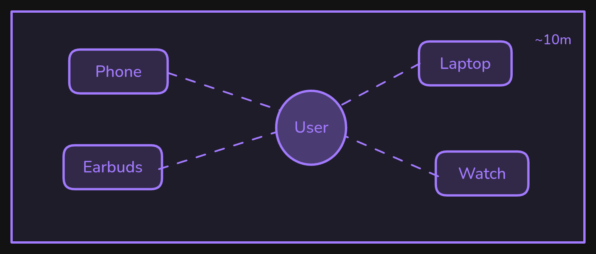
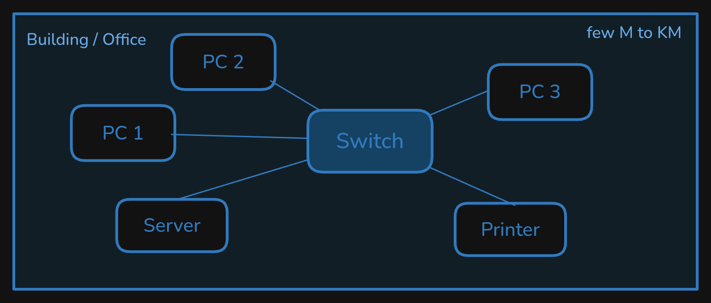
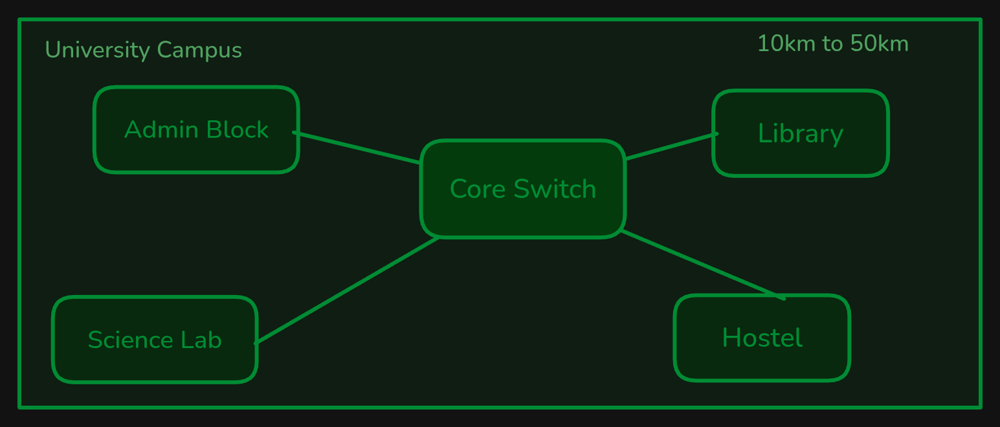
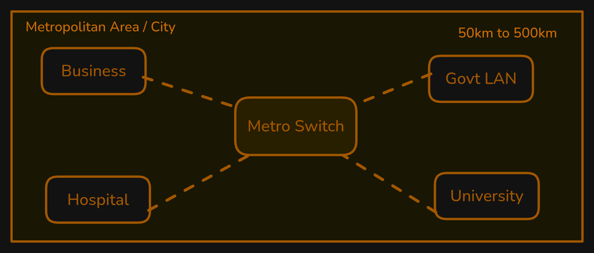
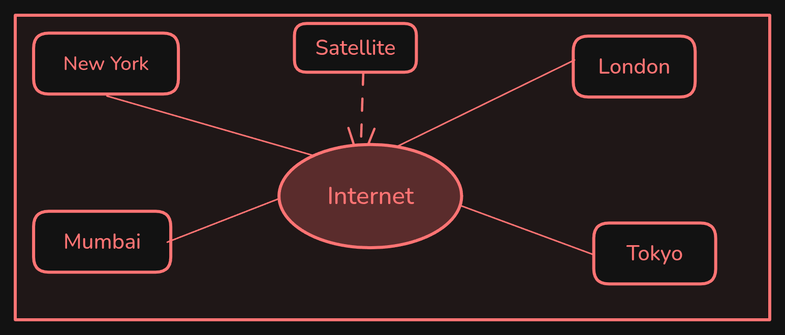
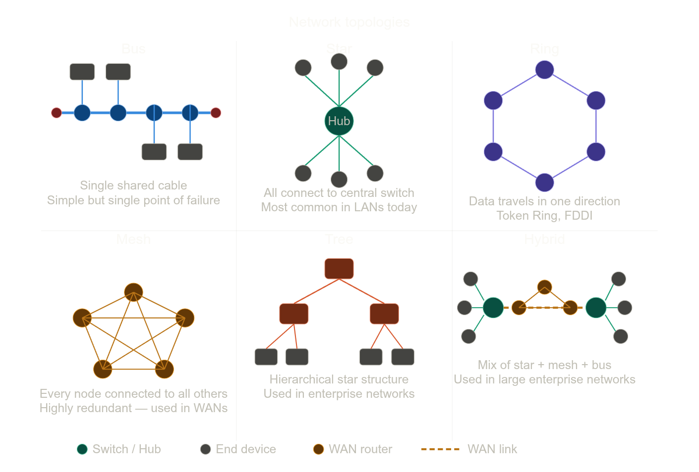

# Computer Network

## What is a Netwrok?

A network is a collection of interconnected things that can communicate or share resources with each other. Ex: Road Network, Poastal Network, Telephone Network, etc.

## What is a Computer Network?

- A computer network is a system of two or more computing devices connected together to share resources, information, and communication. Ex: Internet, Local Area Network (LAN), Wide Area Network (WAN), etc.

### Key Components Computer Network

- Nodes: The devices that are connected to the network. Ex: Computers, Smartphones, Servers, Printers, etc.
- Links: The physical or wireless connections that enable communication between nodes. Ex: Ethernet cables, Fiber optic cables, Wi-Fi signals, Cellular, etc.
- Protocols: Set of rules and conventions that govern how data is transmitted and received over a network. Ex: TCP/IP, HTTP, FTP, etc.
- Network Devices: Hardware devices that enable communication and data transfer within a network. Ex: Routers, Switches, Hubs, Modems, etc.

## Types of Computer Network

1. Personal Area Network (PAN)
2. Local Area Network (LAN)
3. Campus Area Network (CAN)
4. Metropolitan Area Network (MAN)
5. Wide Area Network (WAN)

### Personal Area Network (PAN)

- Connects personal devices within a short range.
- Ranges from few centimeters to few meters.
- Technology: Bluetooth, Infrared, USB, etc.
- Ex: Wireless earbuds connected to laptop or phone, phone hotspot, wireless mouse, etc.

### Local Area Network(LAN)

- It covers small area like a office, building, or school.
- It is privately owned network.
- Ranges from few meters to few kelometers.
- Devices used: Switch, Router, Hub, etc.
- Ex: Home wifi network, school lab connected to wired network, office wifi network, etc.

### Campus area Network(CAN)

- Connects multiple LANs within campus or organization.
- Ranges between 10km to 50 km
- Usually managed by ISP's
- Ex: University campus, city-wide cable tv

### Metropolitan Area Network (MAN)

- Connects multiple networks within a city or multiple cities.
- Ranges from 50 km to 500 km.
- Ex: City-wide network, Cable TV network, etc.

### Wide Area Network (WAN)

- Covers large geographical area.
- Ranges from 500 km to 5000 km.
- Ex: Internet, VPN, etc.

## Network Topology

- Network topology is the arrangement of nodes and links in a network.
- It defines how devices are connected to each other and how data flows through the network.

### Types of Network Topology

1. Bus Topology
2. Ring Topology
3. Star Topology
4. Mesh Topology
5. Hybrid Topology

